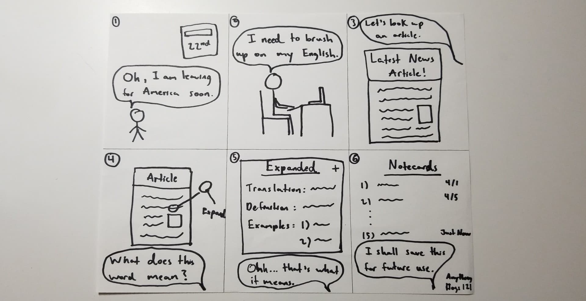
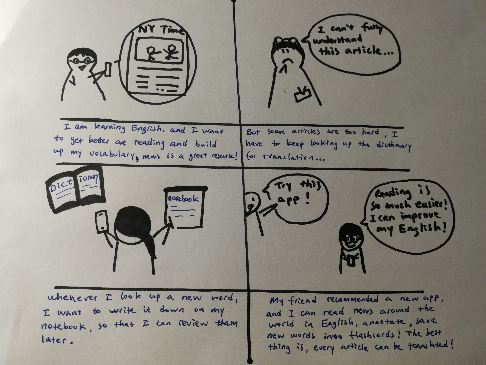
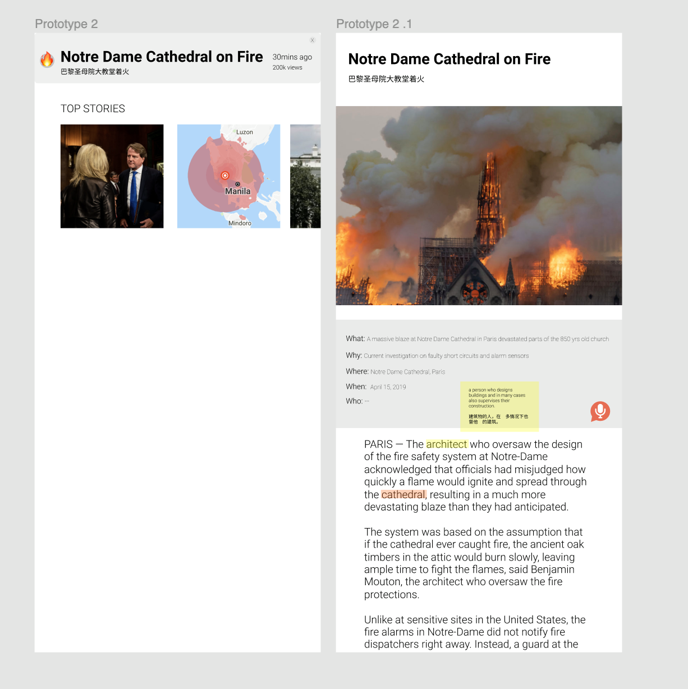

Milestone 1
Cogs 121
4/22/19

TeamName: Anything

Team Member List:
1) Huy Le
2) Alice Lee
3) Madeline Ng
4) Senyan Luo 

Project Proposal 
For our project, we will be making a language learning application. Our application is catered towards those located outside of America trying to learn and study the English language. With this application, we hope to improve our user's proficiency in the English language by incorporating news articles that users can interact with by highlighting keywords they are unable to understand, allowing them to translate as well as create notecards with explanations/descriptions for them to reference back to. As news articles are written quite intrinsically, it is also a great way for user's across the globe to learn formatting, grammar, and punctuation in the English language.

We are excluded from this theme as we each have some degree of proficiency in the English language and this application is for those with little to no experience. An API that we may utilize is the "News API", where we can gather the latest news articles for our users. Another API we may utilize is Google Translate's API. 
 

Storyboard 1: 

 
Storyboard 2: 

  

Prototype 1: 

  

Prototype 1 & 2: 
[Link](https://www.figma.com/file/NBGSAbq0rwmtyLwMtjSdDMUj/COGS-121-PROTOTYPE?node-id=0%3A1)
  

