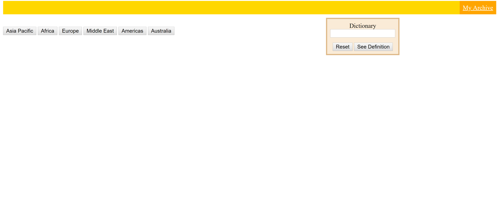
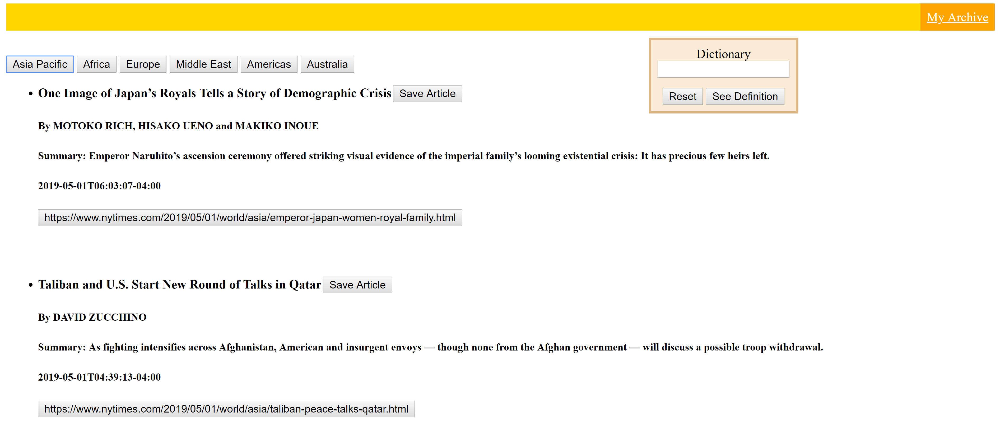
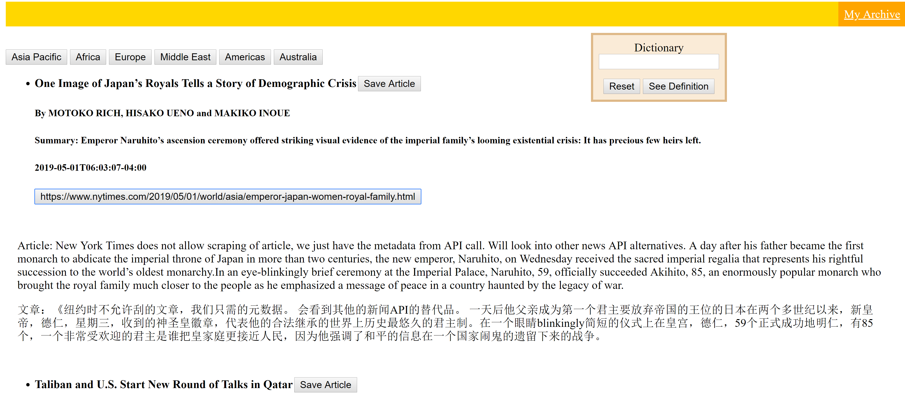
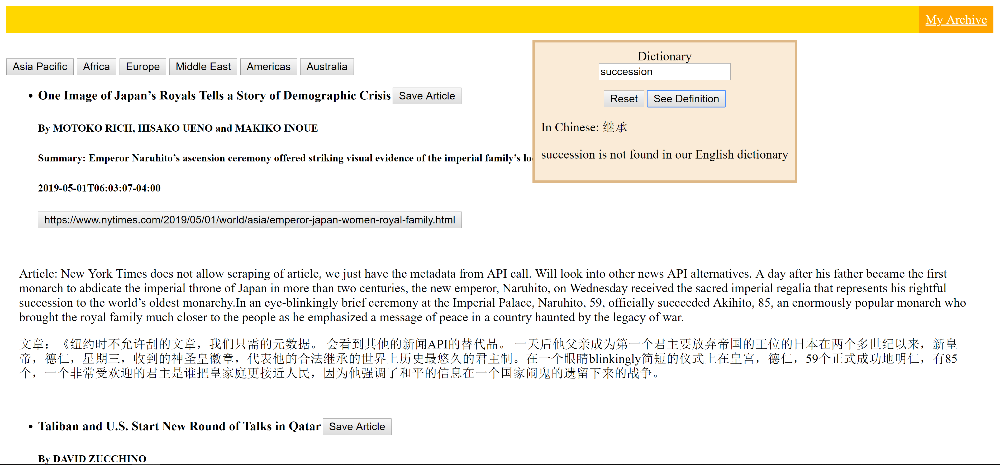
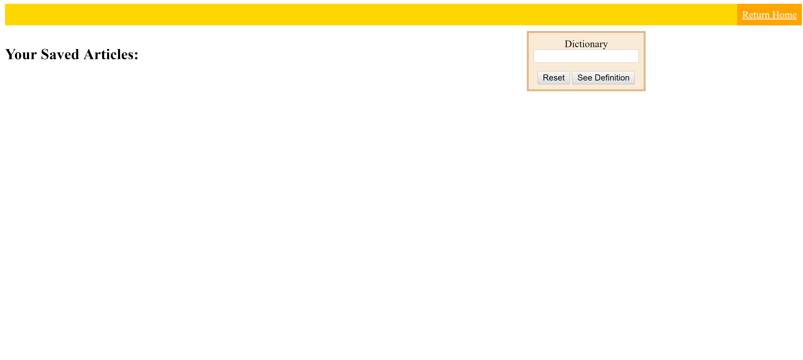

Milestone 2
Cogs 121
5/1/19

TeamName: Anything

1) Similarities and differences from proposal in Milestone 1:
We are sticking with our idea of creating an news application for people who are learning English. However, we modified some functionalities for this minimally-viable product. First, this version will specifically be for Chinese speakers who are learning English. Instead of letting users highlight unfamiliar words for definitions, there is a handy dictionary window embedded on the page, which users can use to look up meanings of words in both English and Chinese. Users can also save articles to their archive, as well as new vocabularies in one's archive as flashcards(feature not included in MVP).

2) Screenshots of Pages: 
 
 
 
 
 
 

3) Although the contients are only links at this point, we aim to realize the map presentation on the landing page as shown in the prototype 1, and similar article layout as in prototype 2. However, since we are not including the highlight feature in our MVP, we substituted that with the hovering dictionary window. 