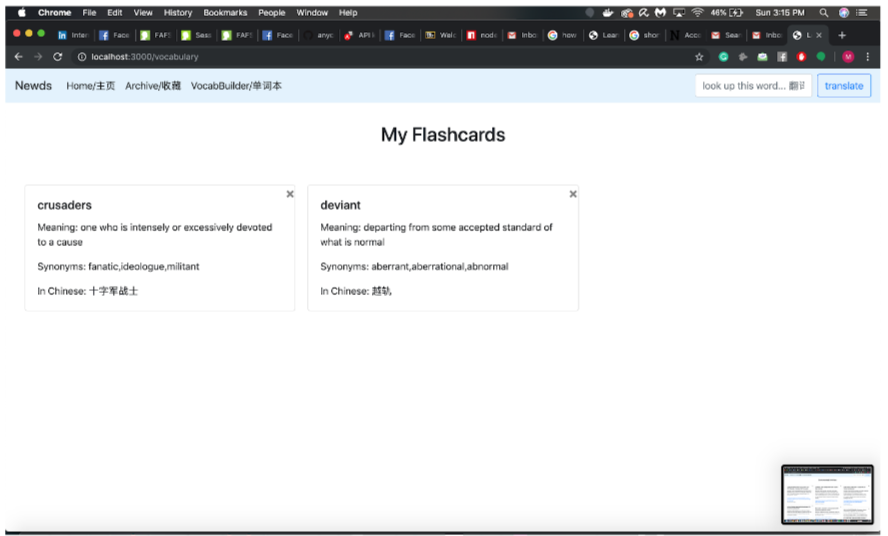
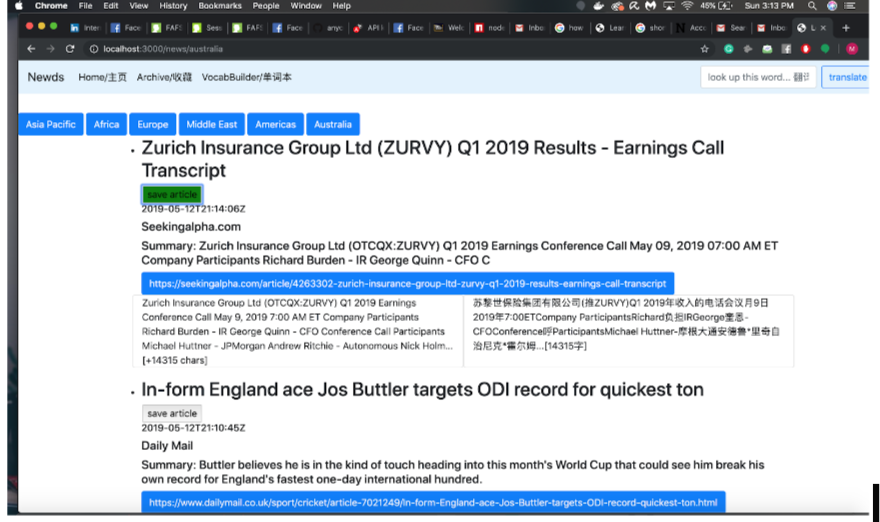
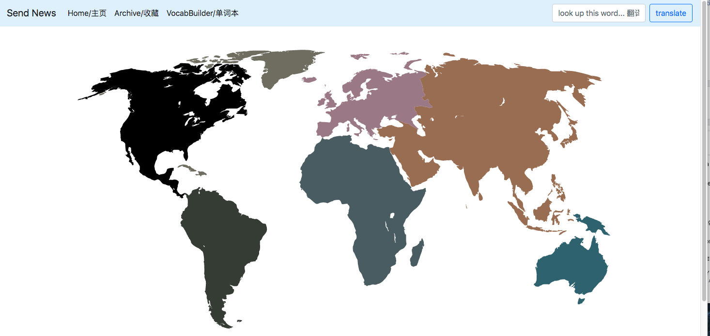
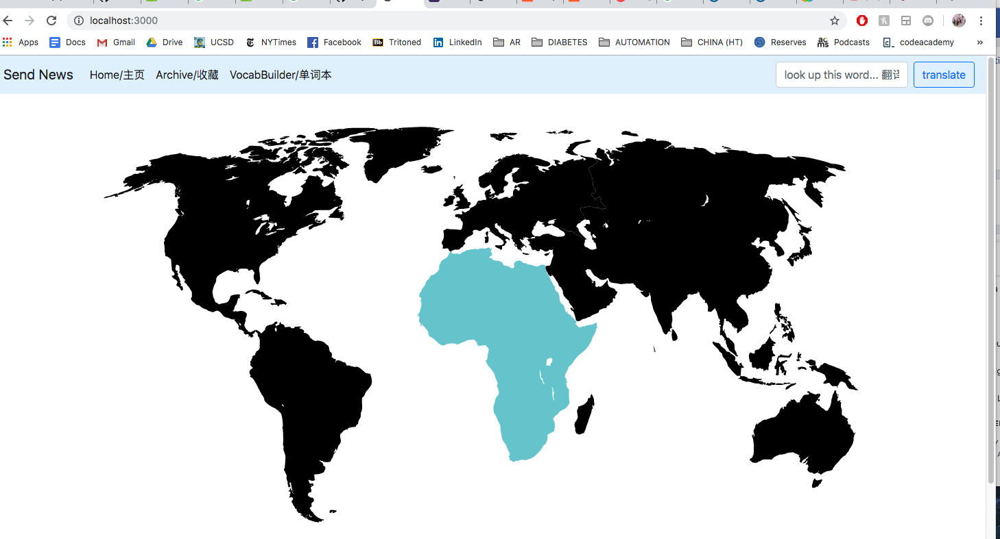

Milestone 3’s UI includes a colored world map on the homepage in replacement of the text navigation bar. The map will 
link to the different countries and the news on there. The previous UI used to be just buttons with country name. In addition, 
we created modals for our flashcards and implemented bootstrap. 

UI SKELETONS for World Map, Newsfeed for Europe, My Flashcards Inventory, Bookmarked Articles, Dictionary Search 
and Add to Vocab Builder

 
 
 
 
 
