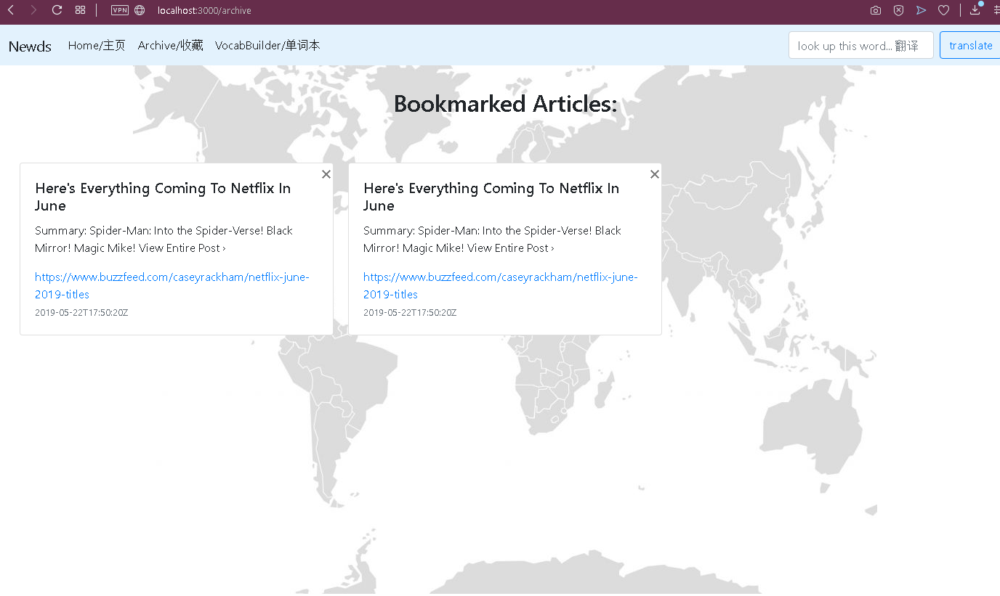

Milestone 4

We altered our home page to have more visuals with different maps to show different locations the users could intuitively click on. There are also backgrounds included in the "Archive" and "VocabBuilder" pages to add to the overall visual appeal.

Storyboard 1: 
 
Description: This is the archive page's visual change.
  

User Action 1: Clicking on continent to get news about that place. 

User Action 2: Looking up a vocabulary word and saving it. 

