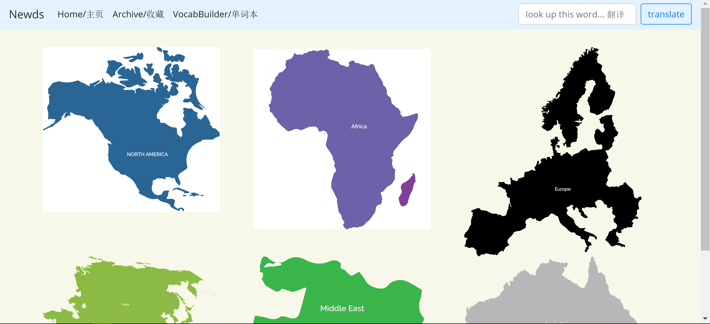
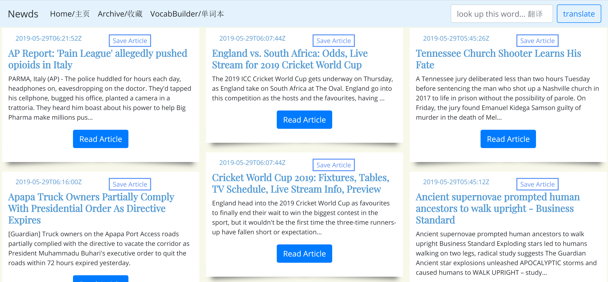
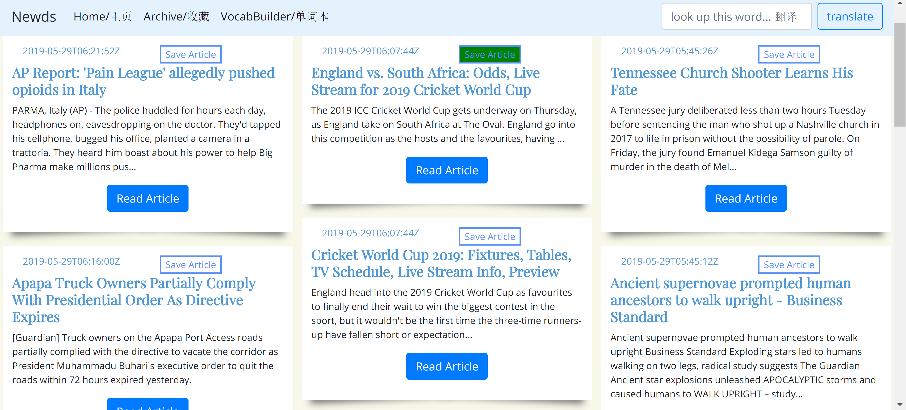
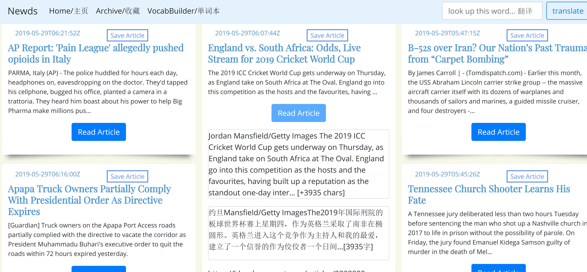

Milestone 5

Our application would be catered to students outside of America trying to learn and improve on their English. With the application, they would be able to view trending articles and read them, allowing them to stay updated with what is happening around the world. In cases when they do not understand something, they are able to utilize the translation feature in order to learn what it means. Not only that, but when the user encounters an interesting read or a word they may want to look back at in the future, then they have the option to save it for future reference.

Revised Map: 
 
Description: This is the Landing page's visual change.
  

Revised Article Page: 
 
Description: This is the revised article page, which is now displayed more neatly.
 

The screenshots reflect the improvements upon the previous milestone as the articles are now displayed more neatly, and the text has been truncated to eliminate wordiness.

Save Functionality: 
 
Description: With the sa
  

Landing Page: 
 
Description: This is the Landing page's visual change.
  

Landing Page: 
 
Description: This is the Landing page's visual change.
  
